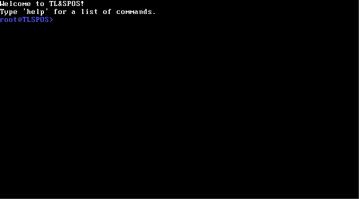
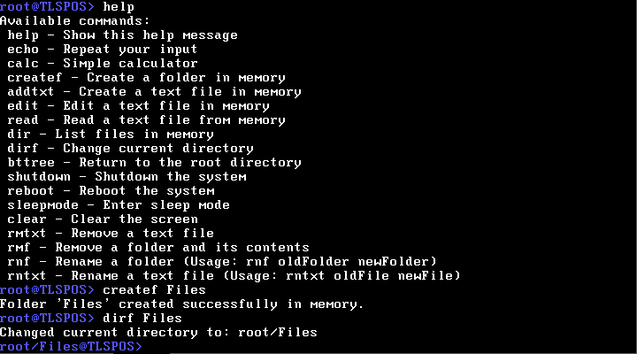
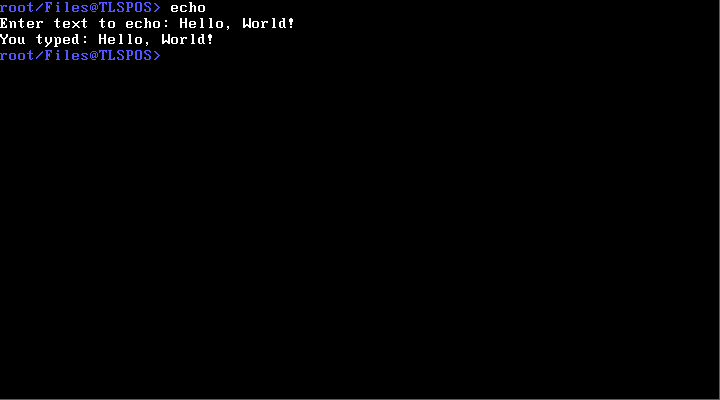

# Welcome to TL&SPOS!

TL&SPOS is an open-source operating system written in C# using the COSMOS (C# Open Source Managed Operating System) kernel. Its interface is inspired by the classic MS-DOS, featuring a text-based command-line environment.

The system is designed primarily as a learning tool and a proof of concept for creating operating systems with modern high-level languages like C#. TL&SPOS focuses on simplicity and is suitable for exploring basic OS functionality and development.

While it doesn’t aim to compete with mainstream operating systems, TL&SPOS provides a starting point for those interested in understanding how an operating system works or experimenting with C# in a low-level programming context.

# Screenshot 1

# Screenshot 2

# Screenshot 3

